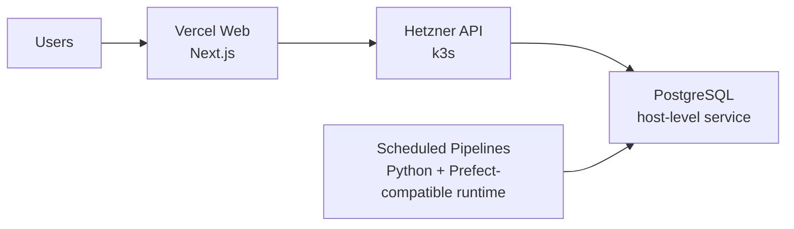

# MVD Future Deployment Design

## Goal

Define the first serious cloud deployment model for Macro Valuation Desk after the local skeleton phase, with a strong focus on learning value, low operating cost, practical scalability, and fast delivery.

## Decision Summary

MVD will use a hybrid hosting model:

- `apps/web` deploys to Vercel
- `apps/api` runs on a Hetzner Cloud VM inside `k3s`
- `apps/pipelines` runs on the same Hetzner VM as scheduled jobs
- PostgreSQL runs on the same Hetzner VM as a host-level service outside `k3s`

This model keeps frontend hosting simple and high-quality while preserving strong learning value in backend operations, orchestration, pipelines, and warehouse hosting.

## Why This Model Was Chosen

The project priorities are:

- high learning value first
- stability second
- operational simplicity third
- low cost with a practical ceiling around `4-7 EUR/month` for this project in the first hosted phase

The selected model fits those priorities because:

- Vercel removes low-value frontend hosting work such as TLS termination, certificate renewal, CDN delivery, and custom domain setup for Next.js
- Hetzner remains the right place to learn Linux operations, backend hosting, scheduled data runtimes, PostgreSQL management, storage decisions, and production-style deployment patterns
- `k3s` provides meaningful orchestration value for the API layer without forcing PostgreSQL into an unnecessarily complex stateful cluster setup on day one
- the resulting architecture stays close to the existing product boundaries and local development shape

## Chosen Runtime Topology

### Frontend

`apps/web` runs on Vercel.

Responsibilities:

- public web delivery
- SSL/TLS and certificate automation
- custom domain integration
- CDN and platform-level frontend scaling
- Next.js deployment workflow

Why:

- self-hosting the Next.js frontend adds little product value in this phase
- Vercel is especially strong for public-facing Next.js delivery
- moving the web app off the VM reduces RAM and CPU pressure on the self-hosted environment

### API

`apps/api` runs on a Hetzner VM inside `k3s`.

Responsibilities:

- serve product-facing API routes
- read warehouse and serving data from PostgreSQL
- scale horizontally inside the VM under load
- expose health checks and support controlled rolling deploys

Why:

- the API is the main public backend runtime that benefits from orchestration
- horizontal scaling, health-based restarts, and deployment control are worth learning here
- this creates a clean growth path toward a larger VM or additional nodes later

### Pipelines

`apps/pipelines` runs on the same Hetzner VM as scheduled jobs, not inside `k3s` initially.

Responsibilities:

- ingest source data
- validate and normalize it
- load raw and modeled data into PostgreSQL
- precompute serving-oriented metrics and tables

Why:

- pipeline load follows schedule, not request traffic
- the pipeline does not need request-driven autoscaling in this phase
- keeping it outside the cluster reduces moving parts while preserving full control

### Database

PostgreSQL runs on the same Hetzner VM as a host-level service outside `k3s`.

Responsibilities:

- act as the source of truth
- store `raw`, `staging`, `warehouse`, and `marts` layers
- support both pipeline writes and API reads

Why:

- PostgreSQL is stateful and operationally more sensitive than the API
- on a single-VM setup, running it outside `k3s` reduces risk and simplifies backups, restore workflows, and storage management
- this keeps the highest-value orchestration learning in the API layer without taking unnecessary risks with the data layer

## Data Flow

### Operational Meaning

1. users access the public site through Vercel
2. the web app calls the Hetzner-hosted API
3. the API reads already-prepared data from PostgreSQL
4. pipelines run `1-2` times per day on schedule
5. pipelines load and precompute data so the API can stay light during user traffic

## Scaling Strategy

### Frontend Scaling

Vercel handles frontend delivery scaling.

This means:

- frontend request spikes do not consume Hetzner VM resources directly
- frontend TLS, domain, and delivery concerns do not need custom server administration
- the self-hosted environment can focus on API, pipelines, and data

### API Scaling

The API uses `Horizontal Pod Autoscaler` behavior inside `k3s`.

Important concept:

- this is horizontal scaling, not vertical scaling
- instead of making one API instance larger, the cluster runs more API replicas in parallel on the same VM when capacity allows

Target behavior:

- normal state: `1` API pod
- elevated load: `2` API pods
- future expansion: optionally `3` API pods if the VM size later justifies it

Primary goal:

- absorb traffic spikes without manual SSH intervention
- reduce the chance that one API process becomes a bottleneck under sudden demand

Important limit:

- HPA does not create new hardware
- it only uses the spare CPU and RAM already available on the VM
- if the VM is saturated, the next step is a larger VM or later an additional node

### Pipeline Scaling

Pipelines do not autoscale in this phase.

That is intentional because:

- they are scheduled jobs, not user-facing services
- they should be optimized for correctness, repeatability, and precomputation rather than request-time elasticity

### Database Scaling

PostgreSQL scales differently from the API.

In this phase, database scaling relies on:

- good schema and index design
- serving-oriented marts and precomputed tables
- avoiding heavy request-time calculations
- vertical scaling of the VM when needed

This means the API should read prepared product-facing data rather than perform expensive on-demand analytics for each request.

## Serving Model

MVD should be designed as a read-heavy public analytics site.

That means:

- pipelines do the heavy data work on schedule
- the warehouse and marts hold prepared outputs
- the API mostly shapes and serves ready data
- the web app presents the data attractively and clearly

This is the intended product-serving model for a public macro and valuation site where request traffic can vary but data refresh cadence is predictable.

## Resource Strategy

### Initial VM Recommendation

Preferred starting point:

- `Hetzner CX33`
- `4 vCPU`
- `8 GB RAM`
- `80 GB disk`

Why:

- enough headroom for `k3s`, API scaling, PostgreSQL, scheduled pipelines, and the OS
- materially safer operational margin than `4 GB RAM`
- better fit for experimentation and learning without immediate memory pressure

Lean minimum:

- `Hetzner CX23`
- `2 vCPU`
- `4 GB RAM`
- `40 GB disk`

Why it is still possible:

- Vercel removes frontend runtime pressure
- pipeline schedule is infrequent
- API traffic is likely low early on

Main drawback:

- much tighter memory margin once `k3s`, PostgreSQL, and scheduled jobs share the same host

### Recommended Starting Choice

Start with `CX23` only if minimizing cost is more important than operational breathing room.

Start with `CX33` if the goal is to learn comfortably, reduce resource stress, and avoid re-sizing too early.

Given the project priorities, `CX33` is the preferred recommendation if the extra cost is acceptable.

## Approximate Resource Budget

### On `CX23`

Rough planning shape:

- OS and base services: `0.4-0.7 GB RAM`
- `k3s` and ingress overhead: `0.5-0.8 GB RAM`
- PostgreSQL: `0.8-1.4 GB RAM`
- API pod: roughly `0.2-0.5 GB RAM` per replica depending on implementation and traffic
- scheduled pipeline runs: temporary CPU and memory spikes during execution

Conclusion:

- feasible
- but not generous
- HPA should stay conservative

### On `CX33`

Rough planning shape:

- the same base services as above
- healthier PostgreSQL memory budget
- better room for `2` API replicas under load
- more tolerance for pipeline bursts
- more operational comfort for experiments and mistakes

Conclusion:

- more production-like
- better fit for the chosen architecture

## API Autoscaling Guardrails

Initial HPA intent:

- minimum replicas: `1`
- maximum replicas: `2`
- evaluate `3` only after observing real usage and actual VM headroom

Why:

- this keeps scaling meaningful without causing wasteful thrashing on a single VM
- the early system does not need aggressive replica counts
- it keeps the autoscaling model simple and observable

## What This Design Optimizes For

- fast delivery
- strong backend and infra learning value
- minimal wasted effort on low-value frontend hosting work
- a clean path from low traffic to moderate growth
- infrastructure choices that match the product's real bottlenecks

## What This Design Does Not Try To Solve Yet

- multi-region delivery
- multi-node database high availability
- distributed PostgreSQL scaling
- complex observability platform design
- enterprise-grade disaster recovery

Those belong to a later stage, after real usage patterns justify them.

## Growth Path

### Stage 1

- Vercel for web
- one Hetzner VM
- `k3s` for API
- host-level PostgreSQL
- host-level scheduled pipelines

### Stage 2

- increase VM size if API or PostgreSQL becomes constrained
- tune indexes, marts, and query patterns
- optionally raise API max replicas if measurements justify it

### Stage 3

- add another node if the API layer needs more resilience or capacity
- keep PostgreSQL strategy explicit rather than accidentally coupling it to stateless scaling assumptions

## Design Outcome

The selected future deployment model is:

- Vercel for `apps/web`
- Hetzner VM for backend and data
- `k3s` for `apps/api`
- host-level PostgreSQL
- host-level scheduled pipelines
- HPA-based horizontal scaling for the API within the VM

This is the best current balance of learning value, cost discipline, operational sanity, and future growth for MVD.
