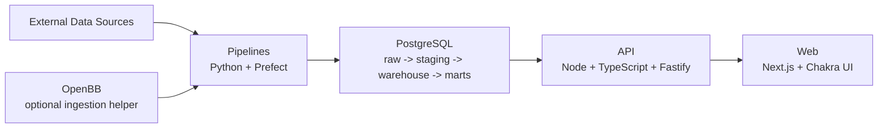

# MVR Desk Foundation Design

## Goal

Define the foundational architecture, data flow, responsibility boundaries, and phase 1 skeleton scope for Macro Valuation Research Desk (MVR Desk), so the project can start with a cloud-shaped but local-friendly structure that supports serious data engineering learning and product growth.

## Project Context

MVR Desk is a macro and valuation research workspace focused on macroeconomics and stock market valuations, especially from the perspective of a value investor. The system should be informed by real data, economic reasoning, and statistical thinking. It should also function as a practical learning vehicle for professional-grade data engineering architecture, ETL methodology, and tool choices.

The project has a hard cost constraint of `0 EUR/month`. Local-first development is acceptable and preferred, but the architecture must stay easy to deploy to the cloud later without a major redesign.

## Design Principles

- Keep the architecture serious, but not heavy for its own sake.
- Do not reinvent infrastructure that mature tools already solve well.
- Separate product serving concerns from data pipeline concerns.
- Keep local development easy enough to use daily.
- Make the cloud path a natural continuation of the local architecture.
- Favor architecture that teaches real DE patterns, not just scripting.

## Selected Architecture

MVR Desk will use a lean monorepo with clearly separated product, API, pipeline, and data layers.

### Stack

- `apps/web`: Next.js + TypeScript + Chakra UI
- `apps/api`: Node.js + TypeScript + Fastify
- `apps/pipelines`: Python + Prefect
- `database`: PostgreSQL
- `infrastructure`: Docker Compose first

### Why This Architecture

This structure gives a clean boundary between:

- presentation and UX
- product-facing data contracts
- orchestration and ETL work
- durable storage and warehouse modeling

It also aligns well with the learning goal: Python is used where modern data engineering actually lives, while TypeScript stays in the product and API layer where shared contracts and frontend integration matter most.

## System Architecture

### Web Layer

The web application is the user-facing MVR Desk product. It owns:

- shell navigation
- theme system
- layouts
- charts and tables
- page composition
- state needed for the UI

It must not embed source-specific data logic or query PostgreSQL directly.

### API Layer

The API is a product-serving boundary. It owns:

- frontend-facing endpoints
- response shaping
- query composition for product use cases
- stable contracts for the UI

It should remain a serving layer, not an ETL runtime.

### Pipeline Layer

The pipeline layer owns:

- source adapters
- orchestration
- ingestion
- normalization
- validation
- transformation
- warehouse loading

Prefect belongs here as part of the pipeline service model. It orchestrates flows and tasks, but it does not replace the pipeline code itself.

### Data Layer

PostgreSQL is the primary store and source of truth. It holds the durable data model used by both the platform and the product.

## Data Flow



### Operational Meaning

1. Data enters through pipeline source adapters.
2. Prefect orchestrates scheduled and on-demand data flows.
3. Pipelines validate and standardize data before loading it.
4. Pipelines write directly to PostgreSQL.
5. The API reads prepared data from PostgreSQL for frontend use cases.
6. The web app renders the `Macro` and `Stock Markets` experiences by consuming API responses.

### Important Boundary

Pipelines do not write through the API.

That boundary exists to keep the serving layer and the ETL layer separate. The API is not a transport layer for warehouse writes. It is a product-facing read layer.

## Repository Structure

```text
economic-command-center/
  apps/
    web/
    api/
    pipelines/
  packages/
    shared/
  infra/
  docs/
    architecture/
    superpowers/
  project-plan.md
```

### Responsibility Split

- `apps/web`: research desk UI
- `apps/api`: data-serving contracts for the product
- `apps/pipelines`: data ingestion and transformation runtime
- `packages/shared`: shared contracts, schemas, and helper types
- `infra`: container and local environment setup
- `docs`: architecture and planning material

## Data Modeling Direction

MVR Desk should adopt a simple warehouse-style modeling path from the beginning:

- `raw`: source-aligned landed data
- `staging`: standardized and cleaned tables
- `warehouse` or `core`: durable domain-level entities and time series
- `marts`: product-serving views or tables shaped for MVR Desk screens

This approach is sophisticated enough to teach the right habits without forcing a large enterprise platform.

## OpenBB Role

OpenBB is allowed as a selective helper in the source ingestion layer.

It is useful when it reduces unnecessary custom integration effort for macro or market data sources. It should not become the owner of:

- MVR Desk's warehouse model
- MVR Desk's orchestration design
- MVR Desk's API contracts
- MVR Desk's product architecture

Used selectively, it accelerates the project without reducing the learning value.

## Deployment Philosophy

MVR Desk should be `Docker Compose first`.

This means the local development stack should already resemble the intended production shape:

- separate services
- shared environment configuration patterns
- networked containers
- explicit service boundaries

The local stack should be easy to boot, but not fake the architecture with shortcuts that would need to be undone later.

## UI and Product Direction

The UI should feel premium, modern, and controlled. It should be credible in front of a banker, fund manager, or serious private investor, but not old-fashioned. The tone should be younger, sharper, and cleaner than a traditional finance terminal while staying restrained.

The system must support both light and dark themes from the start. Dark mode can carry more research desk energy, while light mode should feel clean, high-signal, and institutional.

Phase 1 must already establish the product shell with clear navigation for:

- `Macro`
- `Stock Markets`

## Product Value Focus

The product should create value primarily through:

- macro environment understanding
- market-level valuation context
- regime and backdrop interpretation
- a serious research workflow for value investing

It should not try to win early by competing head-on with mature single-stock valuation products. Single-stock work can exist later as a narrower extension, but it should not define the initial product.

## Phase 1 Skeleton Scope

Phase 1 should validate architecture, not full feature depth.

Included:

- monorepo structure
- Docker Compose local stack
- web application shell
- theme foundation with light and dark support
- API service skeleton
- pipelines service skeleton with Prefect wired in
- PostgreSQL integration
- one thin end-to-end data path
- first-class navigation placeholders for `Macro` and `Stock Markets`

Deferred:

- full macro dashboard suite
- full equity valuation analytics coverage
- advanced auth and permissions
- mature ops platform concerns
- extensive monitoring stack
- broad source coverage

## Risks and Guardrails

### Risk: Overbuilding the platform too early

Guardrail:
Keep phase 1 focused on one proven end-to-end path and the right boundaries, not on maximum infrastructure.

### Risk: UI grows faster than the data model

Guardrail:
Ensure every visible product slice maps back to a clean API contract and a real warehouse-facing data model.

### Risk: Tooling complexity undermines velocity

Guardrail:
Choose mature, boring defaults where possible and let complexity appear only when it earns its place.

## Design Outcome

The result should be an MVR Desk skeleton that already behaves like a real multi-service financial data product, even though the feature depth is still intentionally limited.
