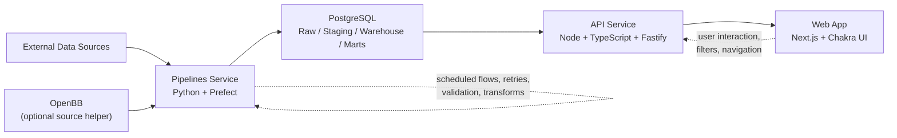

# Macro Valuation Research Desk (MVR Desk)

## Original Project Intent

### Project

Macro Valuation Research Desk (MVR Desk), a macro and valuation research workspace.

### Goals and Purpose

The goal is to provide information about macroeconomics and stock market valuation levels, especially for a value investor, based on real data and strong economic thinking and statistics.

### Style and UI/UX

The style should be very modern. It can take a little inspiration from the other project in `../pro-site-cms`, but not with a dark-only style. A white/light site style should also be supported, so both dark and light themes are part of the product.

The overall feel should be something a banker or investment fund manager could use, but a bit younger and more restrained in a command center direction. Do not overdo it. It should feel more like a 30-year-old banker, portfolio manager, or serious private investor than a 55-year-old old-school bank guy.

The UI stack should use Chakra UI.

### Top-Level Site Sections

1. Macro
2. Stock Markets, with a valuation-first emphasis

### Learning Goals

I want to learn data engineering methodology properly, including ETL processes in a comprehensive way, and how to build a professional-grade DE architecture in practice. I want to learn established, standard-level professional DE libraries, systems, stack choices, and architecture through a real project.

### Requirements

The running cost should be 0 EUR/month. I do not want to pay for anything.

Data may accumulate if we build a data warehouse, but it should still work locally or in some way that does not cost me money. Free services can be used when useful.

### Architecture Considerations

I am completely fine if it runs locally, for example with my own backend logic and a database inside local Docker containers. But I want the service to be easy to host in the cloud with the same architecture and without major changes. It should be production-ready for the cloud, but also local-ready as a research desk.

I also want to consider using the OpenBB platform as a ready-made component where it makes sense.

## Current Direction

This project will start by designing the core architecture and building a first-phase skeleton. The point is to make the key structural decisions early and create proper places for the `Macro` and `Stock Markets` sections, without going too deep into feature details yet.

The first phase is not about building every insight screen. It is about locking the architecture, development workflow, responsibility boundaries, and the data flow so the product can grow cleanly.

The value creation focus should stay on macro analysis, valuation context, and market-level interpretation. This should be more about helping a value investor understand the environment and valuation backdrop better than about competing with existing single-stock valuation tools.

## Architecture Summary

MVR Desk will use a lean monorepo architecture with a clear split between product UI, application API, data pipelines, and storage.

### Core Stack

- `apps/web`: Next.js + TypeScript + Chakra UI
- `apps/api`: Node.js + TypeScript + Fastify
- `apps/pipelines`: Python + Prefect
- `database`: PostgreSQL
- `infrastructure`: Docker Compose first

### Key Decisions

- Monorepo, not a single all-in-one monolith
- PostgreSQL as the source of truth
- Python for data engineering and orchestration
- TypeScript for product UI and API contracts
- Prefect included from the beginning for real orchestration
- Docker Compose first, so local development matches the cloud shape closely
- OpenBB allowed as a helper in the data source layer, not as the owner of the full architecture

## System Responsibilities

### Web

The web app is the research desk interface. Its job is to present data, support navigation, establish the product identity, and handle the user experience for the `Macro` and `Stock Markets` sections.

The web app should not know where data originally comes from. It should only consume clean API responses.

### API

The API is the serving layer between the frontend and the warehouse-facing data model. Its job is to read prepared data from PostgreSQL, shape it into frontend-friendly contracts, and expose stable endpoints for the product.

The API is not the place where pipelines run and not the place where market data ingestion happens.

### Pipelines

The pipelines service is responsible for external data ingestion, validation, normalization, transformation, and loading.

This is where the real data engineering work lives:

- source adapters
- orchestration
- schema validation
- normalization
- warehouse model preparation
- data quality checks

### Database

PostgreSQL is the central system of record. It stores raw ingested data, cleaned and normalized data, warehouse-friendly domain tables, and serving-oriented marts or views for the API.

## Data Flow



### Flow in Plain English

1. Pipelines fetch data from external sources.
2. Prefect orchestrates those flows and tasks.
3. Pipeline code validates, cleans, and models the data.
4. Pipelines write directly to PostgreSQL.
5. The API reads ready-to-serve data from PostgreSQL.
6. The web app fetches data from the API and renders the research desk UI.

Important boundary: pipelines do not write through the API. They write directly to the database. The API exists mainly for product consumption, not for ETL transport.

## Repository Shape

```text
economic-command-center/
  apps/
    web/
    api/
    pipelines/
  packages/
    shared/
  infra/
    docker/
    compose/
  docs/
    architecture/
    superpowers/
  project-plan.md
```

### Why This Structure

- It keeps the responsibilities clean from day one.
- It matches the learning goal around professional data engineering.
- It keeps local development practical.
- It leaves a clean path toward later cloud deployment without a major rewrite.

## Data Model Direction

The warehouse direction should be simple but professional. The initial shape should likely include:

- `raw` ingestion tables for source-level data
- `staging` tables for cleaned and standardized records
- `warehouse` or `core` tables for domain-ready data
- `marts` or serving views for UI-facing metrics and screens

This gives a proper DE learning path without forcing an overly heavy platform from the start.

## OpenBB Role

OpenBB should be treated as a useful helper in the source ingestion layer, especially where it removes unnecessary custom integration work.

It should not replace:

- our own warehouse design
- our own orchestration model
- our own data contracts
- our own product-facing API

Used this way, OpenBB supports the learning goals instead of weakening them.

## UI and Product Direction

The MVR Desk UI should feel premium, focused, and trustworthy. The visual language should fit serious financial use, but still feel current and sharp.

The product should support both dark and light themes from the start. Dark mode can lean more toward research desk energy, while light mode can feel more like a clean institutional research terminal.

The product shell should already reserve clear primary navigation for:

- `Macro`
- `Stock Markets`

Even if the first implementation is still a skeleton, these sections should already exist as first-class product areas, not placeholders hidden behind temporary hacks.

### Scope Focus

The main value should come from:

- macro environment analysis
- valuation context for the broader market
- market regime interpretation
- research workflow for a value investor

Not from trying to become the best single-stock valuation platform on the internet from day one.

## Phase 1 Skeleton Scope

The first implementation phase should focus on the skeleton, not feature depth.

That means:

- monorepo foundation
- Docker Compose local environment
- web shell and theme system
- API service skeleton
- pipelines service skeleton with Prefect wired in
- PostgreSQL wired into the local stack
- one thin end-to-end example data flow
- reserved information architecture for `Macro` and `Stock Markets`

That is enough to prove the architecture, the development workflow, and the cross-service boundaries before deeper feature work starts.

## Non-Goals for Phase 1

- full macro coverage
- full equity valuation engine
- broad factor model library
- advanced auth
- polished production infra
- large-scale observability stack
- every chart and dashboard idea at once

These can all come later. The first win is a clean, serious, expandable research desk foundation.

## What Good Looks Like

Phase 1 is successful if:

- the repo structure feels clean and intentional
- the local stack starts reliably with Docker Compose
- the data flow is understandable end to end
- the web app already looks like an MVR Desk product, even as a skeleton
- the architecture feels cloud-ready rather than local-only
- future data sources and future dashboards clearly have a place to go

## Next Planning Layer

After this document, the next layer is the execution-oriented implementation plan for agents and development work. That plan should stay separate from this file, because this file is for people and architecture understanding first.
